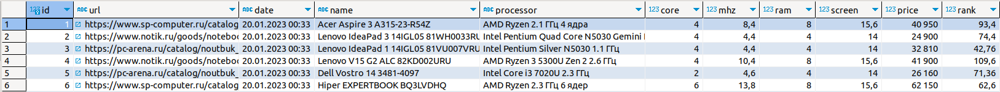
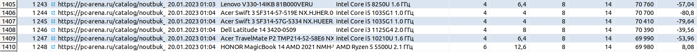
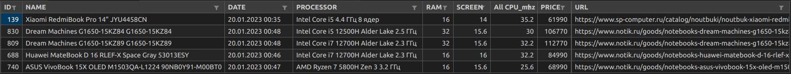

## Решение ДЗ №2 по теме "WEB SCRAPING". ВЫБОР НОУТБУКА  
### *Инструмент: scrapy + sqlalchemy + postgresql*  

---
### Задание:  
* Напишите скрапер собирающий информацию с сайтов на ваш выбор
* должно быть не менее 500 записей о технике
* должны быть данные с не менее чем 2 сайтов
* должно быть складывание в базу
* дожно быть автоматическое вычисление рейтинга сразу (можно средствами субд)
* напишите readme.md с кратким описанием инструкцией запуска
* используйте requirements.txt для указания сторонних зависимостей и их версий
* используйте реляционную субд
* в readme файле укажите какие веса для параметров вы выбрали и топ 5 записей из получившейся у вас таблицы  

---
### Решение:  
Скрапер `асинхронно` собирает информацию с трех сайтов путем перехода по ссылкам на карточку товара и по ссылкам всех страниц:  
* [notik.ru](https://www.notik.ru/)  
* [sp-computer.ru](https://www.sp-computer.ru/)  
* [pc-arena.ru](https://pc-arena.ru/)  
Вся информация сохраняется в `postgresql` в таблицу вида:  
```python
Table nouts {
  id int // primary_key=True, autoincrement=True
  url string // nique=True, comment='Ссылка на товар'
  date string // comment='Время получения данных'
  name string // unique=False, comment='Название товара'
  processor string // unique=False, comment='Тип процессора'
  core int // unique=False, comment='Количество ядер'
  mhz float // unique=False, comment='Суммарная частота процессора'
  ram int // unique=False, comment='RAM'
  screen float // unique=False, comment='Диагональ экрана'
  price int // comment='Цена'
  rank float // comment='Вычисляемый ранг'
}
```  

Автоматическое вычисление рейтинга привлекательности покупки `rank` при записи в БД:  
`rank` = `mhz` * 10 + `ram` * 8 + `screen` * 7 + `price` * -0.004  

---
### Результат:  
Скрапер собрал информацию о 1410 ноутбуках:  
  
 -----//-----
  

Вычислил топ 5 ноутбуков и сохранил в файл `result.csv`:  
  

---
### Инструкция по запуску:
1. Установить пакеты `"pip install -r requirements.txt"`.
2. В Файле `scrpy/base/connections.py` необходимо подставить свои данные по подключению к БД.
3. Запуск `python3 scrpy/main.py`
4. Дождаться завершения работы скраппера, проверить наличие записей в БД и файл result.py.

---
